## 04. Drift Detection 시나리오
Drift detection을 통해 변경 사항이 수동으로 또는 외부 요인으로 발생한 경우에 실제 인프라가 Terraform 구성과 일치하지 않는 경우를 감지하고 복원하여, 인프라를 안전하게 관리하고 일관성 유지

### 2-1) Workspace : Security Group

#### Workflow
<!--  -->


#### 사전 요구사항
- Settings 의 Notification 클릭

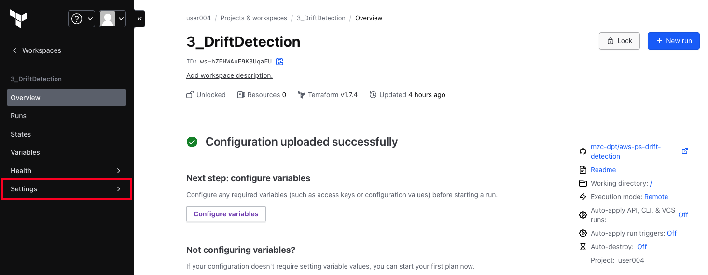
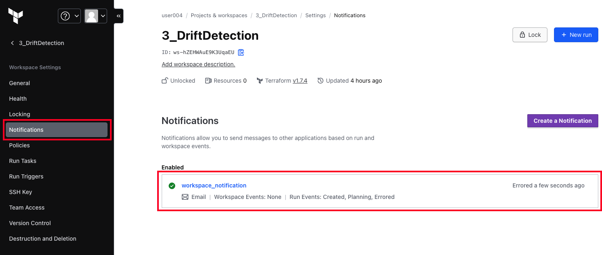

- Notification 수정 : 본인 이메일 기입

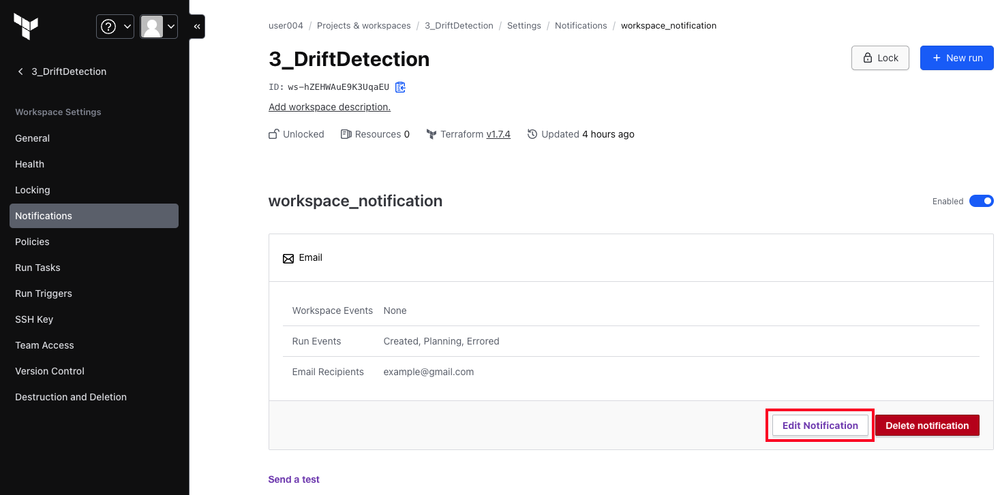
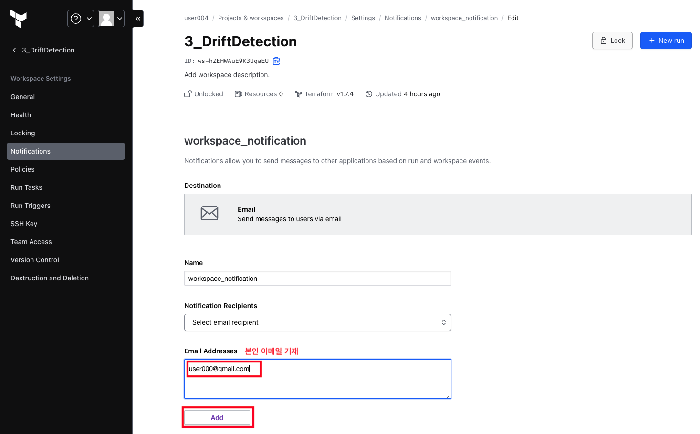

- Email Recipients 에 본인 이메일 정상적으로 추가되었는지 확인 후, Update

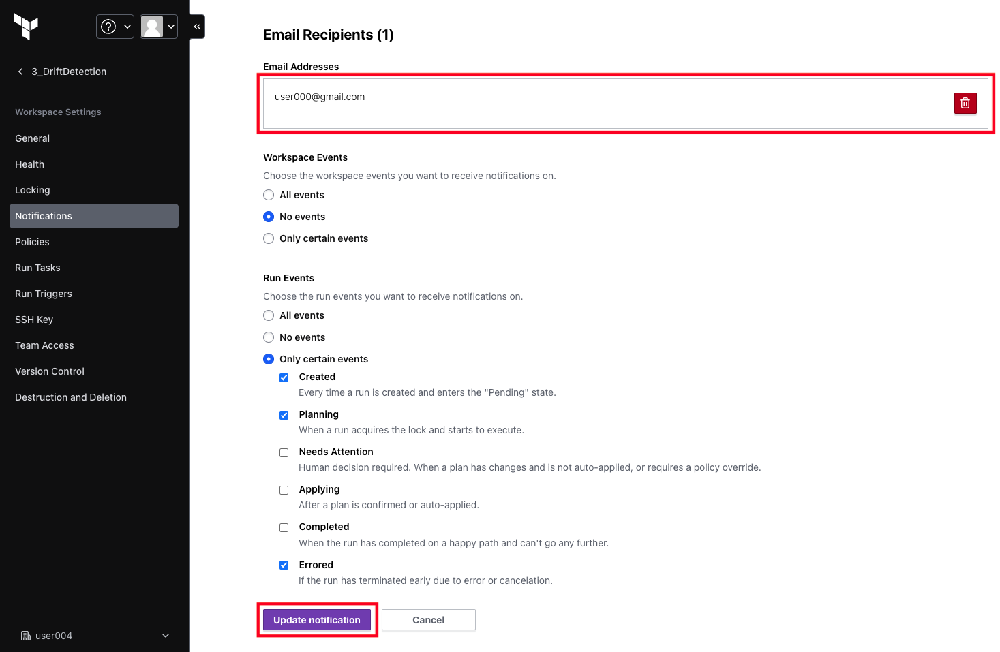


#### (1) 시나리오

- Security Group을 생성한다. 이때 Ingress Rule은 0.0.0.0/0의 `80번 포트` 개방

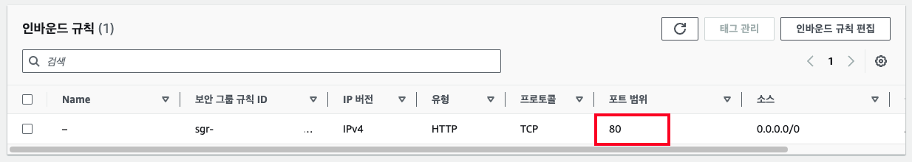

- plan 및 apply 동작 시, email 전송됨

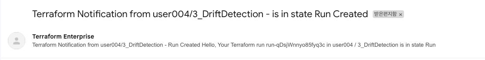
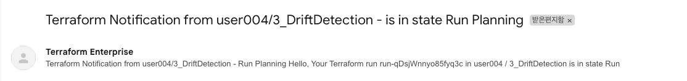
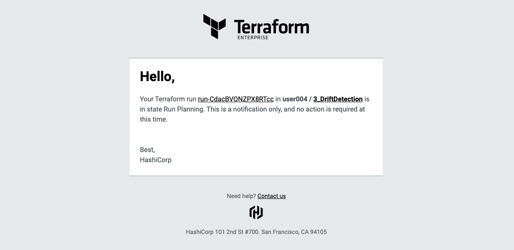


- Health Assessment 클릭 : Healhty 확인

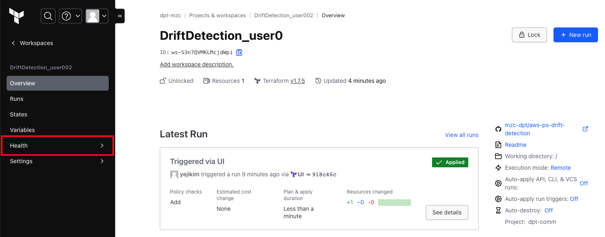
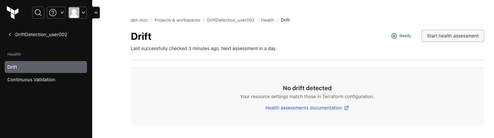

- AWS Console 접속 80번을 81으로 변경


- Health Assessment 클릭 : Drift 감지(Unhealhty)
> Drift가 감지되었으므로 이전 상태로 복구를 진행


- Remediation 실행

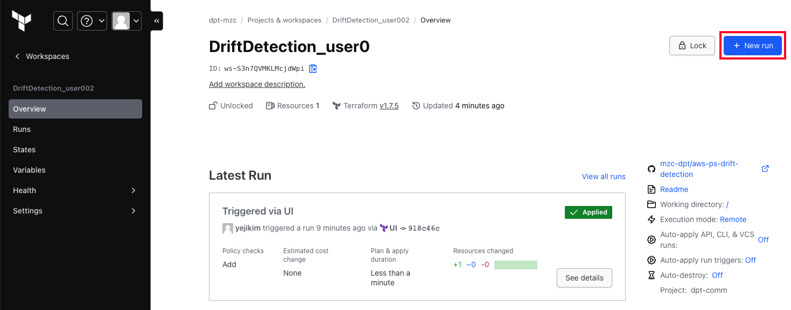

- AWS Console 접속 후 80번으로 복구 확인


- Health Assessment 클릭 : Healhty 확인

#### (2) 샘플코드

- sg.tf 예시
```ruby
resource "aws_security_group" "drift-detection" {
  name   = "drift-detection"
  description = "Example security group for EC2 instances"

  ingress {
    from_port   = 80
    to_port     = 80
    protocol    = "tcp"
    
    cidr_blocks = ["0.0.0.0/0"]
    description = "Allow all inbound traffic"
  }

  egress {
    from_port   = 0
    to_port     = 0
    protocol    = "-1"
    
    cidr_blocks = ["0.0.0.0/0"]
    description = "Allow all outbound traffic"
  }
}
```

<!-- - Default VPC 를 사용하여 Security Group배포 
- Security Group의 Ingress 에 몇몇 규칙 추가하여 테라폼으로 배포 
- Security Group의 Ingress 규칙 추가 (AWS console로 메뉴얼 작업) 
- TFE의 drift detection -->