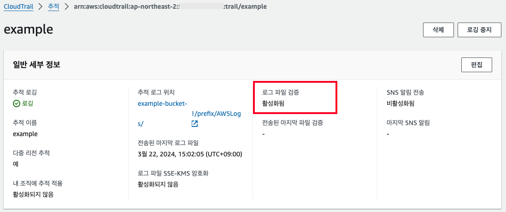
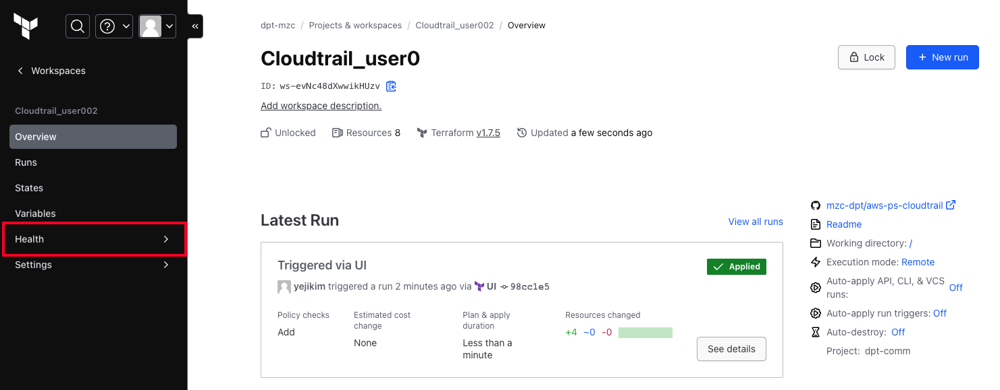
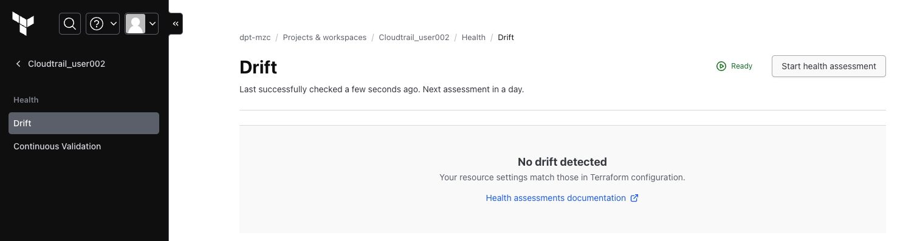
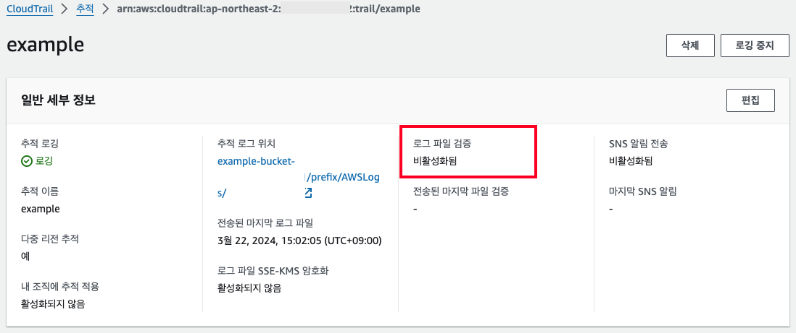
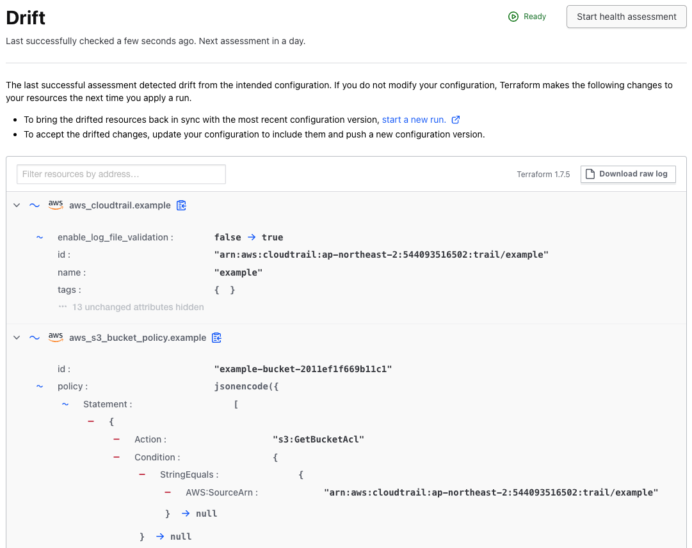
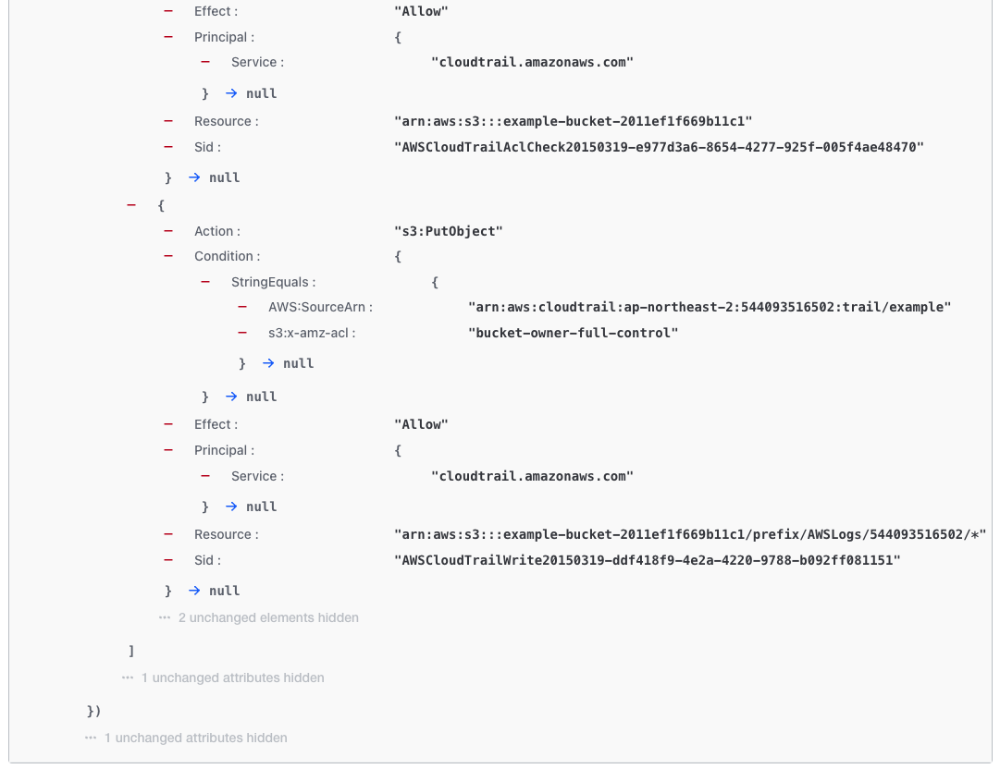
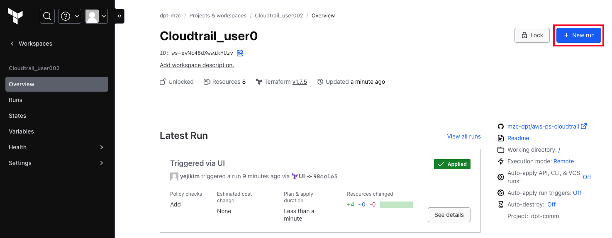
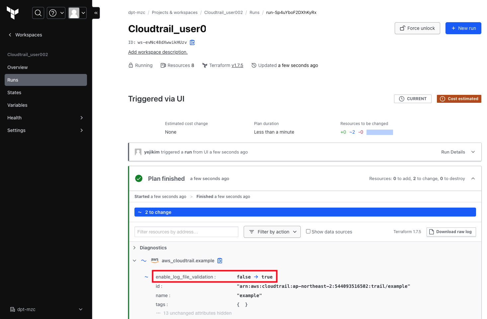
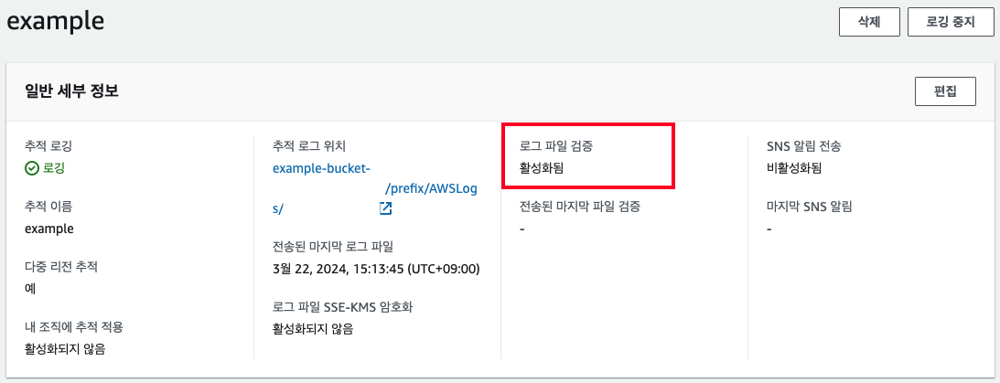

## 05. Drift Detection 시나리오
Drift detection을 통해 변경 사항이 수동으로 또는 외부 요인으로 발생한 경우에 실제 인프라가 Terraform 구성과 일치하지 않는 경우를 감지하고 복원하여, 인프라를 안전하게 관리하고 일관성 유지

### 2-2) Workspace : Cloudtrail

#### (1) 시나리오

- Cloudtrail을 생성한다. 이때 로그 파일 검증에 대해 활성화함


- Health Assessment 클릭




- AWS Console 접속 후 로그 파일 검증에 대해 비활성화함



- Health Assessment 클릭 : Drift 감지(Unhealhty)
> Drift가 감지되었으므로 이전 상태로 복구를 진행



- Remediation 실행



- AWS Console 접속 후 복구 확인



- Health Assessment 클릭 : Healhty 확인

#### (2) 샘플코드

- cloudtrail.tf 예시
```ruby
resource "random_id" "example" {
  byte_length = 8
}

resource "aws_cloudtrail" "example" {
  depends_on = [aws_s3_bucket_policy.example]

  name                          = "example"
  s3_bucket_name                = aws_s3_bucket.example.id
  s3_key_prefix                 = "prefix"
  include_global_service_events = true
  is_multi_region_trail         = true
  enable_log_file_validation = true
}

resource "aws_s3_bucket" "example" {
  bucket = "example-bucket-${random_id.example.hex}"
  force_destroy = true
}

data "aws_iam_policy_document" "example" {
  statement {
    sid    = "AWSCloudTrailAclCheck"
    effect = "Allow"

    principals {
      type        = "Service"
      identifiers = ["cloudtrail.amazonaws.com"]
    }

    actions   = ["s3:GetBucketAcl"]
    resources = [aws_s3_bucket.example.arn]
    condition {
      test     = "StringEquals"
      variable = "aws:SourceArn"
      values   = ["arn:${data.aws_partition.current.partition}:cloudtrail:${data.aws_region.current.name}:${data.aws_caller_identity.current.account_id}:trail/example"]
    }
  }

  statement {
    sid    = "AWSCloudTrailWrite"
    effect = "Allow"

    principals {
      type        = "Service"
      identifiers = ["cloudtrail.amazonaws.com"]
    }

    actions   = ["s3:PutObject"]
    resources = ["${aws_s3_bucket.example.arn}/prefix/AWSLogs/${data.aws_caller_identity.current.account_id}/*"]

    condition {
      test     = "StringEquals"
      variable = "s3:x-amz-acl"
      values   = ["bucket-owner-full-control"]
    }
    condition {
      test     = "StringEquals"
      variable = "aws:SourceArn"
      values   = ["arn:${data.aws_partition.current.partition}:cloudtrail:${data.aws_region.current.name}:${data.aws_caller_identity.current.account_id}:trail/example"]
    }
  }
}

resource "aws_s3_bucket_policy" "example" {
  bucket = aws_s3_bucket.example.id
  policy = data.aws_iam_policy_document.example.json
}

data "aws_caller_identity" "current" {}

data "aws_partition" "current" {}

data "aws_region" "current" {}
```