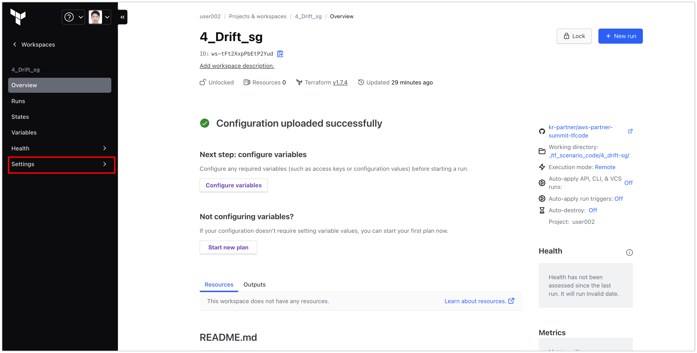

# aws-partner-summit-docs
AWS Partner Summit 2024 핸즈온 실습 가이드 문서

## 사전 요구사항

### AWS Workshop Studio

### TFE 로그인 및 패스워드 초기화

- `hashicorp.secureaws.net` 접속 후 화면

<!--  -->

- "Log in via SAML" 클릭 후 Keycloak 화면으로 전환

> 배정된 좌석의 사용자 명으로 로그인.

- 초기 계정 및 패스워드 입력 후 패스워드 초기화

- 접속 후 할당된 Org의 Invitations을 수락(Accpet)

- 실습을 위한 6개의 Workspace 확인

### 실습을 위한 AWS 크리덴셜 설정

- 좌측의 [Settings] 클릭

- [Organization Settings] - [Variable sets] 탭에서 "PoC Varset" 클릭

- AWS Workshop Studio을 통해 발급된 `AWS_ACCESS_KEY_ID`, `AWS_SECRET_ACCESS_KEY`에 대한 값 추가

- 입력 후 예시화면 : `AWS_SECRET_ACCESS_KEY` 값은 Sensitive 처리

### 실습을 위한 Notification 이메일 기입 (옵션)

- Notification은 `4_Drift_sg`, `5_Drift_Cloudtrail`, `6_Continuous_Validation` 이 3개의 워크스페이스에서 실습을 진행
- 아래 예시는 `4_Drift_sg` 워크스페이스 예시이며, `5_Drift_Cloudtrail`와 `6_Continuous_Validation` 워크스페이스도 동일하게 설정 진행

- [Projects & workspaces] 가 보이는 Console에서 "4_Drift_sg" 클릭 

- 좌측의 [Settings] 클릭

- 좌측의 [Notifications] 클릭
- [Notifications] 탭에서 "workspace_notification_sg" 클릭

- 중앙의 [Edit Notification] 클릭

- [Email Addresses] 에 자신의 이메일정보를 기입하고 "Add" 클릭

- [Email Recipients] 에 자신이 기입한 이메일정보가 등록되었는지 확인

- 최하단의 "Update notification" 클릭

